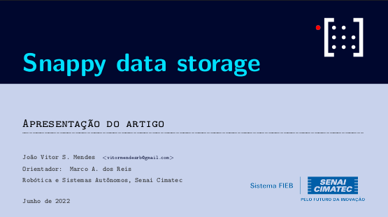

# This presentation
Discussion about Snappy Data Storage, for Robotics and Autonomous System Center(RASC) - SENAI CIMATEC.


## Presentation
<p align="center">
  
</p>


## For use this template

To clone and run this beamer, follow command line above:

```bash
# Clone this repository
$ git clone https://github.com/mhar-vell/mharvellous-beamer

# Go into the repository
$ cd mharvellous-beamer

# Open on VS Code
$ code .

```
### The Styles
The mharvellous beamer offers 4 distinct styles: *default, classic, dark and mracula*.

To change the style you must change the following line in the main file **presentation.tex**:

`\usetheme[style=default]{mhar-vell}`


## Important
Better to view on **[Okular]**


[Okular]: https://okular.kde.org


